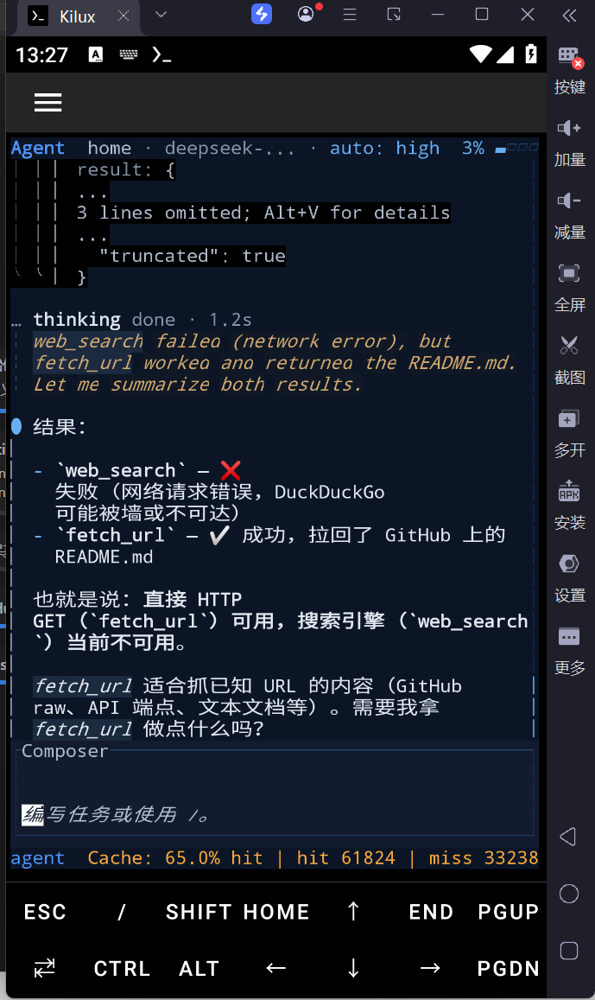

# DeepSeek TUI — Termux 版



> 专为 Android Termux 环境适配的 DeepSeek TUI 终端编程代理。基于 [DeepSeek-TUI v0.8.28](https://github.com/Hmbown/DeepSeek-TUI) 修改，以最小化改动实现在 Termux（Android）下的编译与运行。

[English README](README.md)

---

## 与原项目的区别

本仓库是 [Hmbown/DeepSeek-TUI](https://github.com/Hmbown/DeepSeek-TUI) v0.8.28 的 Termux 兼容分支，仅做了必要的最小化修改：

### 1. 依赖调整 — `crates/tui/Cargo.toml`

| 改动 | 原因 |
|------|------|
| `arboard` 改为非条件依赖（移除 `not(target_os = "android")` 条件编译门控） | Termux 环境下 `arboard` 可通过 `rustls` 编译，无需排除 |
| `reqwest` 的 TLS 后端从 `native-tls` 替换为 `rustls` | Android/Termux 环境缺少 OpenSSL 系统库，`native-tls` 无法编译；`rustls` 是纯 Rust 实现的 TLS，不依赖系统库 |

### 2. 剪贴板适配 — `crates/tui/src/tui/clipboard.rs`

- 移除所有 `#[cfg(not(target_os = "android"))]` 条件编译门控
- 移除 Android 专属的空操作（no-op）剪贴板桩代码
- 剪贴板代码在所有目标下统一编译，由 `arboard` crate 处理

### 3. 浏览器启动兼容 — `crates/tui/src/tui/ui.rs`

- 移除了浏览器启动代码路径上的 `#[cfg(any(target_os = "macos", target_os = "linux", target_os = "windows"))]` 门控
- 使该函数可在 Android 目标下编译（运行时会因平台不支持而返回错误，但不再阻止编译）

### 4. Termux 构建脚本 — `build_deepseek.sh`

新增 Termux 专用构建脚本，预设了 Termux 所需的环境变量：
```bash
export HOME=/data/data/com.termux/files/home
export PREFIX=/data/data/com.termux/files/usr
export PATH=/data/data/com.termux/files/usr/bin:/data/data/com.termux/files/usr/bin/applets
export LD_LIBRARY_PATH=/data/data/com.termux/files/usr/lib
export TMPDIR=/data/data/com.termux/files/usr/tmp
```

---

## 在 Termux 上安装

### 环境准备

```bash
pkg update && pkg upgrade
pkg install rust binutils git make cmake pkg-config
```

### 克隆并编译

```bash
git clone https://github.com/kiluahh/DeepSeek-TUI-termux.git
cd DeepSeek-TUI-termux
bash build_deepseek.sh
```

编译完成后，将二进制文件复制到 PATH：

```bash
cp target/release/deepseek $PREFIX/bin/deepseek
cp target/release/deepseek-tui $PREFIX/bin/deepseek-tui
```

### 验证安装

```bash
deepseek --version
deepseek doctor
```

---

## 使用

与原版 DeepSeek TUI 完全一致：

```bash
deepseek                             # 启动交互式 TUI
deepseek "解释这个函数"                # 单次问答
deepseek --model auto "修这个 bug"     # 自动选择模型与推理强度
deepseek --yolo                       # 自动批准所有工具操作
deepseek auth set --provider deepseek # 配置 API Key
```

详细用法请参考 [原项目 README](https://github.com/Hmbown/DeepSeek-TUI#usage)。

---

## 与上游同步

本仓库会定期跟进上游 `Hmbown/DeepSeek-TUI` 的新版本。如需手动同步：

```bash
git remote add upstream https://github.com/Hmbown/DeepSeek-TUI.git
git fetch upstream
git merge upstream/main
```

合并后如遇编译问题，通常需要关注的改动点：
1. `crates/tui/Cargo.toml` — 确保 `arboard` 为非条件依赖、`reqwest` 使用 `rustls` 而非 `native-tls`
2. `crates/tui/src/tui/clipboard.rs` — 确保没有 `target_os = "android"` 条件编译门控残留
3. `crates/tui/src/tui/ui.rs` — 确保浏览器启动代码路径无平台门控

---

## 致谢

🎖 **感谢原项目作者 [Hmbown](https://github.com/Hmbown) 及所有 [贡献者](https://github.com/Hmbown/DeepSeek-TUI#thanks) 的开源贡献。**

原项目仓库：[https://github.com/Hmbown/DeepSeek-TUI](https://github.com/Hmbown/DeepSeek-TUI)

- 感谢 [DeepSeek](https://github.com/deepseek-ai) 提供的模型与 API 支持，让每一次交互成为可能
- 感谢 [DataWhale](https://github.com/datawhalechina) 🐋 的支持
- 感谢原项目每一位提交 PR、反馈 Bug、撰写文档的贡献者

本仓库仅做了适配 Termux 环境的最小化修改，所有核心功能、架构设计、UI 交互均来自上游项目。

---

## License

与原项目一致：[MIT](LICENSE)

> *与 DeepSeek Inc. 无关联关系。*
